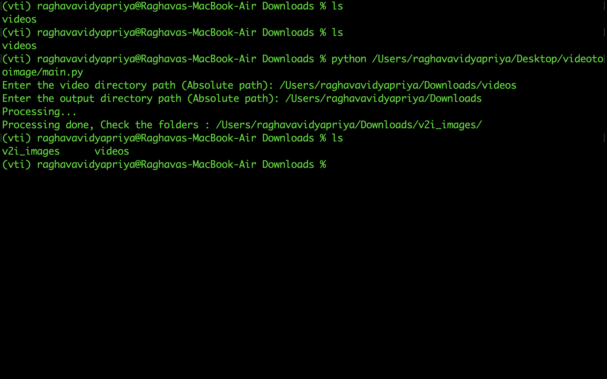

# VIDEO TO IMAGE

_A Python pip package for converting videos to sequential image frames_
<br><br><br>

### 🌟 MILESTONES 🌟

🏆 I published my first PyPI/PIP package. It was used by many of my friends for preprocessing in their ML/Data Science tasks.
<br><br><br>

### AVAILABLE ON PIP

https://pypi.org/project/videotooimage/ <br>

```
pip install videotooimage
```

<br><br>

### PROTOTYPE VIDEO

- PyPI

- Local

<br><br>

### HOW TO EXECUTE

#### Terminal

Python3

```
import videotooimage
result = videotooimage.video_too_image("path/to/video/directory","path/to/output/directory")
print(result)
```

<br><br>

### PURPOSE

- videotooimage is a Python package that provides functionality to convert video files into sequences of images. <br>
- It utilizes the OpenCV library (cv2) to process video files and extract frames. <br>
- This package is useful for tasks such as video analysis, object detection, and machine learning model training using video data.
  <br><br><br>

### FEATURES

- Convert video files (e.g., .mp4, .avi, .mov) into sequences of images.<br>
- Works with various video codecs and formats supported by OpenCV.<br>
- No need to create sub folders for directories manually, It will be created automatically. <br>
- Very useful for machine learning training purposes, the original folder structure is kept as is it.
  <br><br><br>

### PROCESSING

1 sec = 1 frame = 1 image file (.jpg format)
<br><br><br>

### END USERS

1. Students <br>
2. ML Engineers <br>
3. Data Scientists <br>
4. Video editors
   <br><br><br>

### OUTPUTS

- PyPI Package <br><br>
  

- Processing <br><br>
  

- Folder Structure after processing <br><br>
  

<br>

### WORKING

- Folder structure of videos directory (Input) <br>
<pre>
/project
    /videos
        /happy
            person1.mp4
            person2.mp4
            person3.mp4
        /sad
            person1.mp4
            person2.mp4
            person3.mp4
</pre>

- After conversion <br>
  Folder structure of output directory <br>
  <pre>
  /output/folder/
      /v2i_images
          /happy
              person1(frame_number_1).jpg
              person1(frame_number_2).jpg
              person2.mp4
              person3.mp4
              ...
          /sad
              person1(frame_number_1).jpg
              person1(frame_number_2).jpg
              person2.jpg
              person3.jpg
              ... <br>
  </pre>
  <br><br>

### AUTHOR

Name: Raghava <br>
GitHub: https://github.com/raghavavidyapriya/ <br>
Email: raghavavidyapriya@gmail.com<br>
Date Created: March 18, 2024 | Last Updated: May 14, 2024
<br><br><br>

### LICENSE

This package is licensed under the MIT License.
<br><br><br>

### CONTRIBUTIONS

Contributions and feedback are welcome! <br>
Please submit issues or pull requests on GitHub. <br>

GitHub: https://github.com/raghavavidyapriya/videotooimage/
<br><br>

_END OF README_
